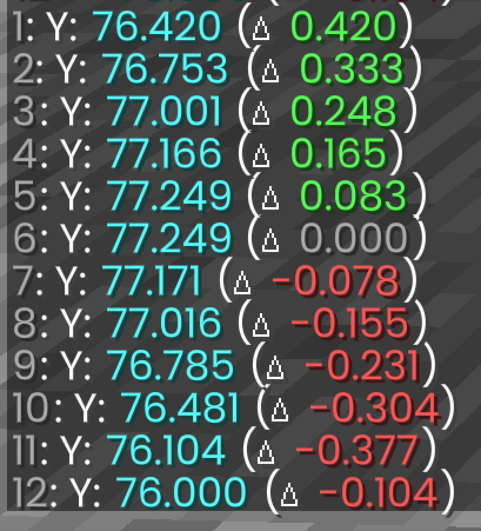
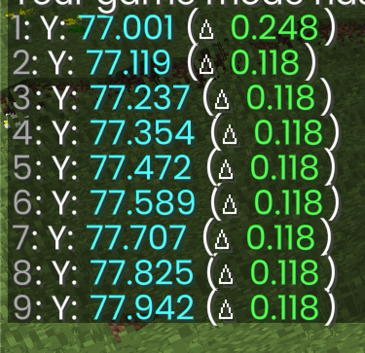
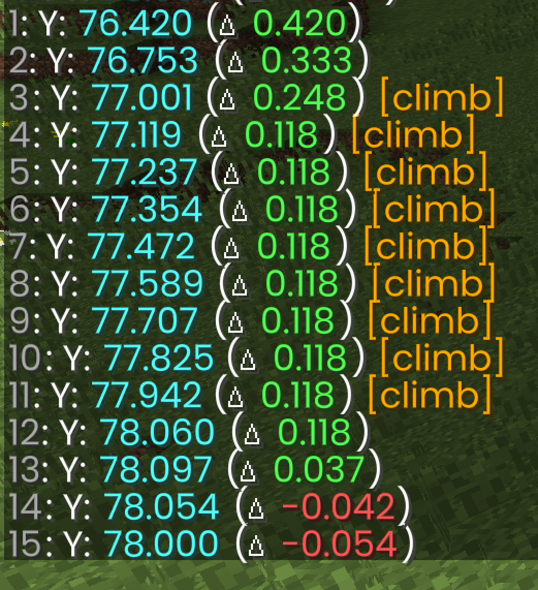
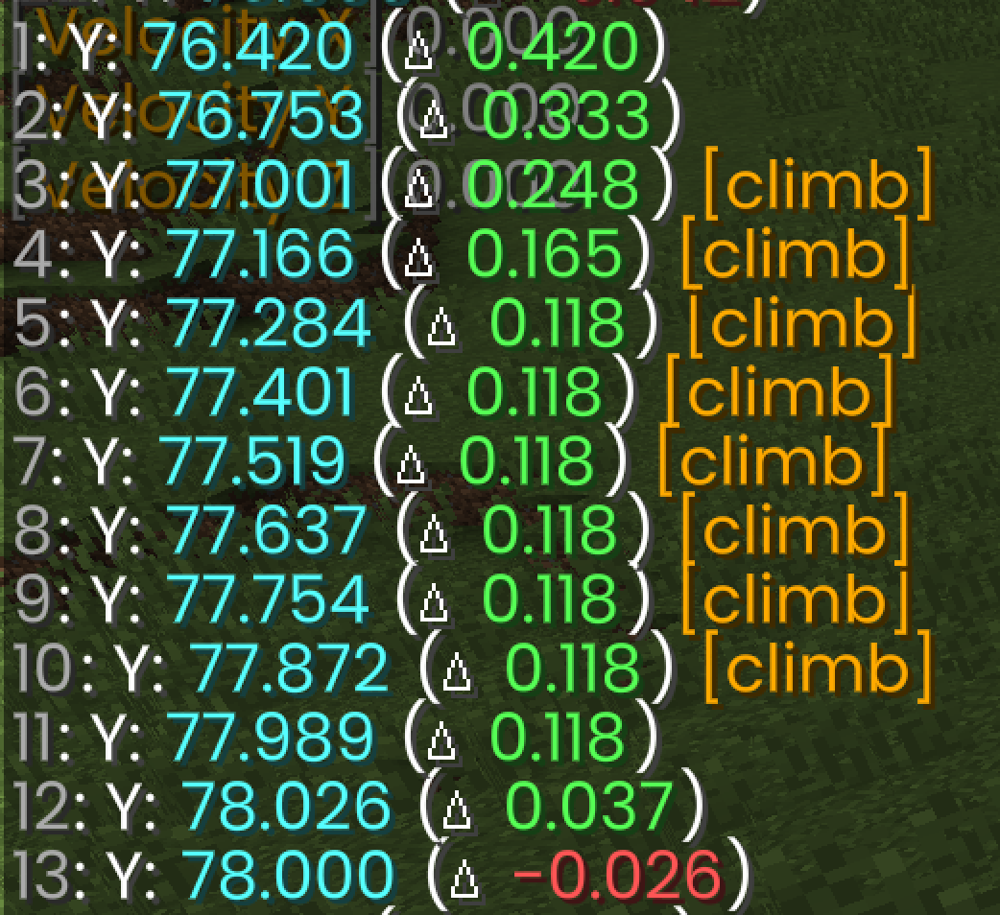

# Ladder Mechanics

Notes from tick-by-tick logging of jumps onto a ladder. Setup: two stacked solid
blocks with a ladder on the front face of the top block (ladder occupies block Y=77,
its top surface at Y=78.0). The player jumps from the ground (Y=76.0), climbs, and
mantles onto the top.

All numbers are the player's **feet Y** after each tick and the **per-tick delta** (`vy`),
as printed by the airborne Y logger (`ChatLadderYLogListener`). `[climb]` marks ticks
where the feet block is a ladder (`onClimbable`).

## The two formulas that explain everything

- **Free fall / jump drag:** `v_next = (v - 0.08) * 0.98`, starting from a jump impulse
  of `0.42`. Applies whenever the ladder isn't actively driving you.
- **Ladder climb speed:** while pressed into a ladder, the game forces `vy = 0.2` each
  tick, which gravity turns into a steady `(0.2 - 0.08) * 0.98 = 0.1176 ≈ 0.118`/tick.
- **Minimum-motion cutoff:** any velocity axis below ~`0.005` is snapped to `0`.
- **Climb detection vs. climb assist are separate things:**
  - `onClimbable` (the `[climb]` flag) is true when the block at your **feet position**
    is a ladder. It does *not* require touching it.
  - The upward climb assist (`vy → 0.2`) only fires when you are **horizontally
    colliding** with the ladder (pushing into it). This distinction is the key to the
    speed trick below.

## 1. Baseline: a regular jump (no ladder)



A clean jump follows the drag formula exactly, up and down:

| tick | Δ | note |
|---|---|---|
| 1 | 0.420 | jump impulse |
| 2 | 0.333 | |
| 3 | 0.248 | |
| 4 | 0.165 | |
| 5 | 0.083 | |
| 6 | **0.000** | apex — velocity decayed to ≈0.003, below the ~0.005 cutoff → snapped to 0 |
| 7 | −0.078 | proof of the clamp: `(0 − 0.08)×0.98 = −0.078` (not −0.075) |
| 8 | −0.155 | |
| … | | |
| last | −0.104 | **landing tick** — fall clipped when feet hit the ground |

Two recurring wrinkles to remember for every jump:
- **Apex hang tick:** one tick of `Δ 0.000` at the peak, from the minimum-motion cutoff.
- **Landing tick:** the final delta is smaller than the formula predicts because movement
  is clipped mid-tick on collision.

## 2. Climbing straight up a ladder




Jumping straight into the ladder and climbing over the top:

| tick | Y | Δ | flag | phase |
|---|---|---|---|---|
| 1 | 76.420 | 0.420 | | free jump |
| 2 | 76.753 | 0.333 | | free jump |
| 3 | 77.001 | **0.248** | `[climb]` | grab — residual jump momentum |
| 4 | 77.119 | 0.118 | `[climb]` | steady climb |
| … | | 0.118 | `[climb]` | steady climb |
| 11 | 77.942 | 0.118 | `[climb]` | last tick on the ladder block |
| 12 | 78.060 | 0.118 | | **carry-over** step clears the 78.0 edge |
| 13 | 78.097 | 0.037 | | ballistic: `(0.118−0.08)×0.98` |
| 14 | 78.054 | −0.042 | | cresting |
| 15 | 78.000 | −0.054 | | landing, clipped, settles on top |

Key points:
- **The grab tick keeps your jump speed (0.248).** On-ladder handling only clamps
  *horizontal* speed (±0.15) and *downward* fall (to −0.15). Upward motion passes
  through untouched, so you keep whatever jump velocity you had when your feet entered
  the ladder block.
- **No apex hang tick on the ladder** — the climb assist actively drives `vy`, so it
  never decays into the cutoff.
- **The "invisible" edge tick (12).** It's a full `0.118` step even though `[climb]` is
  gone: the velocity was set at the end of tick 11 while still on the ladder and carries
  into tick 12, lifting your feet above 78.0. Once your feet are above the ladder block,
  `onClimbable` turns off *and* the climb assist stops re-arming — so ticks 13–15 are a
  plain ballistic hop onto the block top.

## 3. Speed trick: brush the ladder from the side



Approaching from the side instead of flush saved **2 ticks** of airtime (landed tick 13
instead of 15).

| tick | straight | side |
|---|---|---|
| 3 | 77.001 Δ0.248 `[climb]` | 77.001 Δ0.248 `[climb]` |
| 4 | 77.119 **Δ0.118** `[climb]` | 77.166 **Δ0.165** `[climb]` |
| last `[climb]` | tick 11 (77.942) | tick 10 (77.872) |
| edge/exit | tick 12 → 78.060 | tick 11 → 77.989 |
| peak | 78.097 | 78.026 |
| land | tick **15** | tick **13** |

Why it's faster — two effects:

1. **You keep an extra ballistic tick (tick 4 = 0.165 vs 0.118).** Climb speed (0.118)
   is *slower* than your still-decaying jump early on. Coming in flush, the ladder grabs
   you at the end of tick 3 and caps tick 4 to 0.118. Brushing from the side means you
   aren't horizontally colliding yet, so the climb assist doesn't fire and your ballistic
   0.165 carries through — a free +0.047 of height that shifts the whole climb up.

2. **You mantle with almost no overshoot.** Being 0.047 higher, you clear the top edge a
   tick earlier and let go of the ladder just *below* 78.0. You cross the top in gentle
   ballistic decay (Δ0.037), overshooting to only **78.026**. The straight run instead
   gets a full climb kick right at the edge (77.942 → 78.060) and sails up to **78.097** —
   a big overshoot that takes 3 ticks to fall back. Small overshoot = 2-tick settle vs 4.

**General lesson:** ladder climb speed (0.118/tick) is slower than your jump's early
velocity. Any trick that delays *committing* to the ladder (brushing it from the side)
lets you trade slow climb ticks for fast ballistic ticks and clip the top with less
overshoot.

## 4. Sneaking to catch a ladder (1.8)

Being on a ladder only **caps** your fall to −0.15/tick — it doesn't stop you. Holding
**sneak** adds one more rule: any downward motion is zeroed, so you grip instantly.

```java
// EntityLivingBase, ladder handling (1.8)
this.motionX = clamp(this.motionX, -0.15, 0.15);
this.motionZ = clamp(this.motionZ, -0.15, 0.15);
this.fallDistance = 0.0F;
if (this.motionY < -0.15) this.motionY = -0.15;      // fall capped, NOT stopped
if (this.isSneaking() && this instanceof EntityPlayer && this.motionY < 0.0)
    this.motionY = 0.0;                               // sneak grip: downward → 0
```

(Newer versions express the same idea as `isSuppressingSlidingDownLadder()`.)

**Why it's better for catching:** without sneak you keep sliding down (up to 0.15/tick)
until you actively start climbing, so you catch the ladder *lower* than where you first
touched it, by an amount that depends on your incoming speed → inconsistent. Sneak zeroes
the downward motion the instant you're on the ladder, so you stick at the exact height you
first contacted it — highest catch, zero slide, deterministic.

The sneak grip only fires on a tick where **all three** hold at once:

1. `isOnLadder()` — your feet block is the ladder (exactly the tick `[climb]` shows),
2. you're sneaking, and
3. `motionY < 0` (moving down).

### When to sneak

**Hold sneak as you approach — don't try to tap it on the intersect tick.** Sneaking early
is completely free: while you're not on the ladder, or still moving *up*, the grip does
nothing (it only touches negative `motionY`). There is no "too early".

- **Late is the only failure mode.** Intersect on tick N but sneak on N+1 → you slide up to
  0.15 blocks on tick N before gripping. Early = free, late = lost height. Bias early.
- **Bonus — grip at your apex.** Because the grip only kills *downward* motion, if you
  catch the ladder while still rising (e.g. the residual-jump-momentum grab in §2), your
  upward momentum carries you to its peak, then the first tick `motionY` turns negative it
  snaps to 0. You stick at the highest possible point — automatically, just by holding
  sneak through the approach.
- **Caveat — don't press into the ladder if you want to stop.** Pushing forward triggers
  the climb assist (`isCollidedHorizontally && isOnLadder → motionY = 0.2`), which shoves
  you up regardless of sneak. For a clean catch-and-stick: **sneak, don't press in.** For
  catch-and-climb: press in, and sneak becomes irrelevant to the upward motion.

## Quick reference

| quantity | value |
|---|---|
| jump impulse | 0.42 |
| gravity | 0.08 / tick |
| drag | ×0.98 / tick |
| drag formula | `v_next = (v − 0.08) × 0.98` |
| steady climb speed | 0.1176 ≈ 0.118 / tick |
| min-motion cutoff | ~0.005 (below → 0) |
| ladder clamps | horizontal ±0.15, downward fall −0.15 (upward: unclamped) |
| sneak on ladder (1.8) | zeroes downward `motionY` → instant grip, no slide |
| climb assist requires | `onClimbable && horizontalCollision` (sets `motionY = 0.2`) |
| `onClimbable` detection | block at the player's feet position is a ladder/vine |
